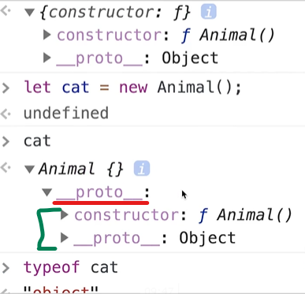

# Javascript 기본 1

## 스코프

- var 로 선언한 변수는 함수 레벨 스코프를 갖는다.
- let, const는 블록 레벨 스코프를 갖는다.
- 블록 레벨 스코프는 {} 중괄호 안에서 변수를 만들었다면, 그 블록 레벨 스코프 내에서만 살아있고, {}를 벗어나면 사용할 수 없다.

## 호이스팅

- 선언문을 맨 위로 끌어올린다. (런타임 이전)
- 자바스크립트가 파일을 읽어올때(런타임 전)에 파일 전송 내용을 싹 확인하고, 실행한다는것(런타임 이후)은 코드 한줄 한줄을 동작하게 만드는것.
- 런타임 전 파일을 쭉 한번 훑어보고, 자바스크립트 엔진이 변수같은것을 실행해야겠다 하고 실행할 준비를 한다. (실행 컨텍스트)
- var는 선언을 하기 전에도 쓸 수 있는데, 호이스팅 때문에 가능하다.
- 실행컨텍스트에 변수가 등록되어있는데, var로 선언된 변수가 있으면 문서 맨 위로 끌어올린다. 그래서 맨 아래에 있던 변수가 맨위에 온 것처럼 동작하기 때문에 선언 이전에 호출하면 실행이 되는 것이다.

### let, const는 변수를 실행 컨텍스트에 등록하는 단계가 var와 다르다.

- 변수를 실행 컨텍스트에 등록할때 선언, 초기화, 할당 단계를 거친다.
- a라는 변수가 있어 (선언), a라는 변수에 값을 담을 공간(메모리)에 등록하려고 찜하는 단계
- 할당은 값을 메모리에 직접 저장하는 단계

### var같은 경우 선언과 초기화를 동시에 해버린다.

> 선언을 하면서 이미 초기화가 되어버렸으니 메모리에 공간이 생긴다.

### let, const는 호이스팅이 되었어도, 메모리에 공간이 없다.

> 선언은 되어서 a라는 변수가 있다는건 알지만, 선언단계에서 메모리가 있는지 없는지는 아직 모르기 때문에 ReferenceError 가 발생한다. (메모리에 아직 공간 확보를 안해놨다.)

#### 변수가 선언만 되어있는 상태를 TDZ(일시적 사각지대) 상태라고 한다.

> ### 정리

- let, const도 호이스팅이 된다.
- 레퍼런스 에러가 나는 이유는 TDZ때문이다.
- 호이스팅(=선언 끌어 올리기)은 된다! 다만, 선언한 후, 초기화 단계에서 메모리에 공간을 확보하는데, 선언을 호이스팅해도 초기화 전까지 메모리에 공간이 없다! 그래서 변수를 참조할 수 없기 때문이다. ** 이걸 TDZ라고 한다. **
- let, const 선언도 호이스팅 된다.
- 스코프에 진입할 때 변수를 만들고, TDZ가 생성되지만 코드 실행이(=실행 컨텍스트가) 변수가 있는 실제 위치에 도달할 때까지 엑세스를 못할 뿐!

## 자료형

- 자료형에도 범위가 있다. 숫자형의 경우 정수, 부동 소수점을 넘어가는 숫자는 BigInt형 에 저장한다. -숫자형, 문자형, 논리값(boolean형), 값이 할당되지 않은 undefined, 값이존재하지 않는 null, 자료구조를 저장하는 객체형, 고유 식별자(하나 밖에 없는 값)를 만드는 심볼형이 있다.
- 원시형과 객체형으로 구분된다.

## 객체

- 원시형과 객체형의 타입은 여러 타입의 데이터를 담을 수 있는가 없는가의 차이이다.
- 원시형은 오직 1가지 타입만 담는데, 객체는 여러가지 타입을 담는다.
- 배열이나 객체는 여러가지 타입의 데이터를 담을 수 있기 때문에 객체타입이다.
  <code>{key:value}</code>
- key는 무조건 문자다. 1,2로 key를 입력해도 사실 문자로 저장된다.
- key에 대응하는 value를 가져올려면 key.value key['value'] 대괄호 접근법과, 마침표 접근법이있다. (대괄호 접근법은 ''로 감싼다.) -배열은 key가 없는것 같지만 사실 key가 있다. 배열[index]로 가져올 수 있다. **배열도 객체이다.**
- <code>let num = 1</code> 로 선언하면 자바스크립트 엔진은 <code>let num = new Number(1)</code>로 변환되서 해석되고 있다. 객체도 마찬가지

* **const로 선언한 객체는 값을 수정할 수 있다.**

### const로 선언한 객체는 값을 수정할 수 있는 이유

- 메모리에 값이 들어갈때 원시형과 객체형은 다르게 저장된다.
- 원시형은 메모리에 1이라고 박아버린다.
- 객체형 타입은 메모리에 저장될때 객체가 들어가는 영역 메모리의 다른 공간에 들어간다.
- **메모리에 주소가 들어가는 것을 객체에 대한 참조**가 들어간다고 한다.
- **객체가 변해도 메모리 주소는 변하지 않고, 객체에 대한 참조가 변하기 때문에 const로 객체를 담아도 메모리 주소 자체가 바뀌는 것이 아니기 때문에 객체의 값을 변경할 수 있다.**

## 함수

- 자바스크립트에서 함수는 특별한 값으로 취급한다.
- 함수도 객체중의 하나로 취급된다.
- 함수는 <code>()</code>로 호출하고, 행동이 되는 값이라고 이해하면 좋다.
- 응용하면 함수를 복사 할 수 있고 매개변수로 전달할 수 있다.
- 함수 선언문, 함수 표현식 방법이 있다.

```javascript
function cat() {
  console.log("g");
}

let cat = function () {
  console.log("a");
};
```

- 두가지 방식의 차이점은 **독립된 구문으로 존재하는가**, **표현식의 일부로 존재하는가**의 차이다.
- 함수 선언문은 실행컨텍스트에서 바로 선언, 초기화가 이루어진다. (var처럼 동작시킨다.)
- 함수 표현식으로 만든 함수는 실행컨텍스트에서 선언단계와 초기화 단계가 나눠져서 실행된다. (let, const처럼)
- 화살표 함수는 함수 표현식의 단축형이다.
- 화살표 함수와 함수 표현식의 차이점은 this 차이와 생성자를 못쓰며, 제너레이터로 못쓴다는 차이점이 있다.
- 함수 표현식에서 그 함수 자체인데 화살표 함수에서 this는 그 부모를 불러온다.
- 사실 함수 생성하는 방식은 생성자로 만드는 방법도 있다.

### 함수는 어떤 프로퍼티에 렉시컬 환경을 참조한다.

- 숨긴 프로퍼티인 [[Environment]]에 저장된다.
- 함수가 있는 위치를 기록한다. a라는 함수 안에서 만들어진 함수라면, [[Environment]]는 a를 기록한다.

```javascript
function b() {
  let a = new Function("console.log('aaa')");
}
// a의 경우 자기가 태어난 환경을 b로 저장해야된다.
// 함수 생성자로 만들어버리면 b로 저장하는게 아니라 무조건 전역 레시컬 환경을 참조한다.
// 함수 b에다가 a를 생성자 함수로 만들었다.

function b() {
  // 여기에 p를 선언했따.
  let p = 1;
  let a = new Function("console.log(p)");
}
b();
// 이렇게 생성자로 만들면 p를 쓸 수 없다.
// 생성자 함수로 만들지 않았다면 에러가 나지 않는다. p는 외부 변수이기 때문에 a에서 쓸 수 있어야 한다.
// 생성자 함수로 만들었기 때문에 전역 변수들만 접근할 수 잇는데, p는 함수안에 있기 때문에 접근할 수 없다.
// 생성자 함수를 쓰면 외부 변수를 받아다 쓰는데에 문제가 있다.
// 인수를 사용하는 방법으로 문제를 해결할 수 있지만 생성자 함수를 사용하는걸 권하지 않는다.
```

#### 렉시컬

- 실제로 어떤 코드를 짜서 확인할 수 있는게 아니라 이론상이다.
- 자바스크립트 동작 원리를 설명할 때 많이 얘기하기 때문에 일단 넘어간다.

## 지역변수 전역변수

- 함수 스코프는 함수 범위. 함수의 중괄호 범위

```javascript
function b() {
  // 변수 p는 b함수의 지역변수이다.
  let p = 1;
  // a함수에서 p는 외부 변수가 된다.
  let a = function () {
    console.log(p);
  };
}

// 전역변수
let p = 1;
// 여기서 p는 외부변수이면서 전역 변수가 된다. 상대적
let a = function () {
  console.log(p);
};

// 지역변수
function b() {
  // 변수 p는 b함수 중괄호 내에서만 사용가능하다.
  // 스코프를 벗어났다.
  let p = 1;
  // a함수는 b의 함수 내부에 있기 때문에 p를 사용할 수 있는 것이다. (b함수의 스코프 내에 있다)
  let a = function () {
    // 이렇게 p를 선언하면, 2가 나오는데 스코프가 다르기 때문이다.
    // 내부변수가 외부 변수보다 사용하는 우선 순위가 높다.
    let p = 2;
    console.log(p);
  };
}
```

## 정리

### 지역 변수

- 함수 내에서 선언한 변수
- 함수 내에서만 접근 가능

### 외부 변수(global 변수라고도 합니다.)

- 함수 외부에서 선언한 변수
- 함수 내에서도 접근할 수 있다.
- 함수 내부에 같은 이름을 가진 지역 변수가 있으면 사용할 수 없다.

```javascript
let a = "a";
let b = "b";
let c = "outter!";
const abc = () => {
  let b = "inner!";
  c = "c";
  let d = "d";
  console.log(a, b, c, d);
};

console.log(a, b, c, d); // a, b, outter, undefined

abc(); // a, inner, c, d

console.log(a, b, c, d); // a, b, c, undefined
```

## 콜백 함수

- 함수에 어떤 매개변수(파라미터)를 받아올 때

```javascript
function useBall(cat) {
  console.log(cat, "공놀이중");
}
// action인 매개변수는 useBall 함수이다.
function playWithCat(cat, action) {
  action(cat);
}
// useBall 같은 함수를 콜백 함수라고 부른다.
playWithCat("perl", useBall); // perl 공으로 노는중
```

### 매개변수와 인수.

- 객체는 메모리에 저장이 되고 있다가 수정이 되면 메모리 주소를 참조한다.
- 함수에 넘겨줬을때 값이 바뀌면 어떻게 되는가?
- 값을 복사해서 쓰고 버린다 = 매개변수라고 한다.
- 매개변수는 인수를 복사한 값이다.
- 매개변수를 파라미터로 받아서 변경해도 원본이 손상되지 않는다.
- 인수는 아규먼트라고 하고, 매개변수는 파라미터라고 부른다.

## 프로토타입(Prototype)

- 자바스크립트는 동적언어이다.
- 자바스크립트의 클래스는 ES6의 키워드고 진짜 클래스는 아니다. ( 자바스크립트가 클래스 기반 언어를 흉내낸것이다.)
- **리터럴로 값을 만들지언정, 자바스크립트 엔진은 생성자로 변환해서 만든다.**
- 자바스크립트에서 객체는 생성자 함수를 가지고 만든다.
- 클래스 기반 언어(java,c++)는 클래스를 만들고, 객체(인스턴스)를 생성

### 자바스크립트는 프로토타입 기반 동적언어이다.

- 프로토 타입은 디자인 패턴중 하나 (다른 언어에서도 쓰는 패턴)
- 객체 생성을 할때 비용(리소스)이 들어가는데 최대한 절감하려는 애를 쓰는 패턴이다.
- **프로토 타입 패턴 자체의 동작은 원본 객체를 복사해서 새로운 것을 만든다.**
- 자바스크립트와 엮어서 보면 어려울 수 있다.

### 필수로 알아야 하는 것 2가지 (중요)

1. 객체는 함수를 사용해서 만들어진다.(생성자 함수)

- 자바스크립트는 프로토타입 기반이기 때문에 자바스크립트의 모든 객체(함수도 객체)는 프로토 타입을 모두 갖고 있다. (상속받기위해)

#### 객체는 함수의 프로토타입(원형) 객체를 복사해서 객체를 만든다.

2. 객체는 자기가 어디서 복사가 되었는지 알고 있다 (렉시컬 환경)

#### 정리

> 자바스크립트의 모든 객체는 자신의 부모 객체와 연결되어 있다.
> 좀 더 정확히는 부모 객체의 원형하고요!(부모 객체의 프로토타입)
> 마치 객체 지향에서의 상속 개념처럼 부모 객체의 프로퍼티나 메소드를 상속받아 쓸 수 있다.
> (실제로는 상속보다 위임에 가깝다고 하지만, 통상적으로 상속한다고 표현)
> 이런 **부모 객체를 프로토타입 객체, 혹은 그냥 프로토타입**이라고 부른다.
> 그리고 부모 객체를 참조하는 걸 두고 프로토타입 링크라고 한다.

#### 예제

```javascript
// 1. 함수를 만들면 함수도 객체이기 때문에 프로토타입이 같이 생긴다.
function Animal() {}

Animal.protyotype;
// constructor 속성과 __proto__속성이 있다.
// constructor는 같이 만들어진 함수를 가르킨다. (원형은 프로토 타입 자체)
// 프로토타입 객체를 만들어서 프로토타입(원형)에 넣어준다.
```

1. 함수를 만들면 함수의 프로토타입도 같이 만들어진다.
2. 프로토타입에는 <code>constructor</code> 속성과 <code>`__proto__`</code>갖고 있는 객체이다.
3. constructor에는 Animal 함수가 들어있다.
4. Animal 함수의 prototype속성에 Animal의 프로토타입이 들어있다.

#### Animal 함수를 사용해서 객체를 만들어 볼 때

```javascript
let cat = new Animal(); // 생성자 함수를 사용해서 cat을 만듬
cat; // cat을 찍으면 Animal{} 이라고 나옴.
// cat은 Animal을 사용해서 만든 객체
typeof cat; // object
// cat에는 __proto__가 있고 constructor에 부모인 f Animal()을 가르킴
// __proto__ 안에는 또 프로토가 있다.
```

<br/>

- Animal의 prototype과 같은게 나온다.
- cat이라는 객체 안에 `__proto__` 링크는 내 부모를 가리키고 있다고 생각하면 된다.
- `__proto__` 프로토타입 링크 안에는 또 링크가 있다. 이 링크는 타고 타고 올라간다.
- cat의 부모는 Animal이고 Animal의 부모는 Object이다.
- 이렇게 쭉 연결되어 있는것을 프로토타입 체인이라고 부른다
- 부모와 자식 관계가 연결되어 있다고 생각하면 된다.

### 설치

- nvm 노드 버전 관리
- npm 노드 패키지 관리
- 새로운 버전을 설치하면 다 새로 버전을 설치해야한다.
- React Developer Tools 설치 (컴포넌트 구조를 볼 수 있게 해줘서, 디버깅할때 편함)
- Redux DevTools / 리덕스 확인할때 편함. 액션을 일으킬때 어떤 값이 있었고 어떤 값으로 변경되는지를 확인가능
- React Extension Pack (필요한것들 대부분 들어있음)
- prettier - 코드 예쁘게 정돈

### 기획서

- 프로토 타입 툴 / 제플린, 피그마 등등

#### 컴포넌트 쪼개는 방법

1. 디자인

- 피그마를 보면서 같은 디자인인 애들의 컴포넌트를 뺀다.

2. 기능적

- input , button 따로 쪼개서 모아서 큰게 되게 하는 방법(아토믹 디자인 패턴)
- 큰거를 쪼개서 작은것으로 가는 방법 (이거로 시작)

> #### 튜터 팁
>
> 디자인을 뽑아서 쪼개서 쭉 적어놓고 한다. (디자인적, 데이터적으로도)
> 노트에 정리하면서 하면 컴포넌트 쪼갤때 좋다.
> 필수로 필요한 props가 너무 많으면 쓰는게 더 힘들기 때문에 컴포넌트는 쓰기 편하고, 필요한 조건이 너무 많지 않게 사용하는게 좋다.
> 컴포넌트는 너무 단위가 적어도 너무 커도 안되기 때문에 경험이 필요하다

### 시작

1. yarn add react-router-dom
2. yarn install 하면, package.json 에 있는 것들 모두 설치가능

## Promise

- 자바스크립트는 싱글 쓰레드로 동작한다. (메인 쓰레드 1개와 콜스택 1개로 구성)
- 비동기 작업은 동시에 할 수 있다.
  > #### 비동기 작업은 동시에 가능한 이유
  >
  > 자바스크립트 엔진은 Web API(ajax, dom, setTimeout 등)가 있고, 콜스택, 콜백큐, 이벤트 루프가 있어서 비동기 작업을 도와준다.
  > 예를 들어서 setTimeout 요청이 오면 먼저 콜스택에 들어간다. 콜스택은 먼저 web api에 위임한다.
  > setTimeout 시간이 끝난후 함수를 넘겨줄때 콜백큐에 콜백함수를 넘겨준다.
  > 그 다음 콜백 큐는 이벤트 루프를 통해서 콜스택에 콜백함수를 다시 넣는다.
  > 이런 방식으로 처리.
  >
  > 1. 비동기 작업은 콜스택에 들어감 2. 위임되서 한번 사라짐. 3. 처리한후 콜백큐에 콜백함수(처리된 다음의 행동을)를 넣어줌 4. 콜스택이 처리한후 스택에서 빠짐

### 콜백이란

- 어떤 함수에 인수로 넘겨주는 함수를 콜백함수라고 한다.
- **비동기 작업에서 말하는 콜백은 자바스크립트가 비동기 처리를 하기 위한 패턴 중 하나이다.**

#### 콜백 헬

- 비동기 작업이 엄청 많을때, 비동기 작업이 끝난후 보통 어떤 값을 가져오고 이 값을 가지고 또 비동기 작업을 처리한다. (비동기 처리가 중첩될수록 깊이가 길어지고 관리가 힘들어진다.)
- 이런 문제를 콜백 헬이라고 한다. (꼬리에 꼬리를 물고 계속 들어감)

### 콜백 헬을 해결하기 위한 Promise (ES6)

- **비동기 연산이 종료된 이후에 결과를 알기 위해 사용하는 객체이다.**

```javascript
// 프라미스는 생성자 함수를 통해 만든다. (객체)
// 인자로는 (resolve, reject) => {} 이런 excutor 실행자(혹은 실행 함수라고 부른다)를 받는다.
// 이 실행자는 비동기 작업이 끝나면 바로 두 가지 콜백 중 하나를 실행한다.
// resolve: 작업이 성공한 경우 호출할 콜백
// reject: 작업이 실패한 경우 호출할 콜백
const promise = new Promise((resolve, reject) => {
	if(...){
		...
		resolve("성공!");
	}else{
		...
		reject("실패!");
	}
});
```

#### 프라미스 상태 값

- pending: 비동기 처리 수행 전(resolve, reject가 아직 호출되지 않음)
- fulfilled: 수행 성공(resolve가 호출된 상태)
- rejected: 수행 실패(reject가 호출된 상태)
- settled: 성공 or 실패(resolve나 reject가 호출된 상태)

#### 프라미스 후속 처리 메서드

- 프라미스로 구현된 비동기 함수는 프라미스 객체를 반환하죠!
- 프라미스로 구현된 비동기 함수를 호출하는 측에서는 이 프라미스 객체의 후속 처리 메서드를 통해 비동기 처리 결과(성공 결과나 에러메시지)를 받아서 처리해야 합니다.
- .then(성공 시, 실패 시)
  then의 첫 인자는 성공 시 실행, 두번째 인자는 실패 시 실행됩니다. (첫 번째 인자만 넘겨도 됩니다!)

  ```jsx
  // 프라미스를 하나 만들어 봅시다!
  let promise = new Promise((resolve, reject) => {
    setTimeout(() => resolve("완료!"), 1000);
  });

  // resolve
  promise.then(
    (result) => {
      console.log(result); // 완료!가 콘솔에 찍힐거예요.
    },
    (error) => {
      console.log(error); // 실행되지 않습니다.
    }
  );
  ```

  ```jsx
  // 프라미스를 하나 만들어 봅시다!
  let promise = new Promise((resolve, reject) => {
    setTimeout(() => reject(new Error("오류!")), 1000);
  });

  // reject
  promise.then(
    (result) => {
      console.log(result); // 실행되지 않습니다.
    },
    (error) => {
      console.log(error); // Error: 오류!가 찍힐거예요.
    }
  );
  ```

  .catch(실패 시)

```jsx
// 프라미스를 하나 만들어 봅시다!
let promise = new Promise((resolve, reject) => {
	setTimeout(() => reject(new Error("오류!"), 1000);
});

promise.catch((error) => {console.log(error};);
```

#### promise chaining(프라미스 체이닝)

- 프라미스는 후속 처리 메서드를 체이닝해서 여러 개의 프라미스를 연결할 수 있습니다! (이걸로 콜백 헬을 해결할 수 있어요!)
- 체이닝이 뭔데? 그걸 어떻게 하는 건데?
  후속 처리 메서드 (then)을 쭉쭉 이어 주는 거예요.
  ```jsx
  new Promise((resolve, reject) => {
  	setTimeout(() => resolve("promise 1"), 1000);
  }).then((result) => { // 후속 처리 메서드 하나를 쓰고,
  	console.log(result); // promise 1
  	return "promise 2";
  }).then((result) => { // 이렇게 연달아 then을 써서 이어주는 거예요.
  	console.log(result);
  	return "promise 3";
  }).then(...);
  ```

#### async, await

1. async

- 함수 앞에 async를 붙여서 사용한다.
- 항상 프라미스를 반환 (프라미스가 아닌 값이라도, 프라미스로 감싸서 반환)

```javascript
// async는 function 앞에 써준다.
async function myFunc() {
  return "프라미스를 반환"; // 프라미스가 아닌 걸 반환해본다.
}

myFunc().then((result) => {
  console.log(result);
}); // 프라미스를 반환이 찍히고 , Promise 반환된다.
```

2. await

- async의 짝꿍. async 없이는 못쓴다.
- async 함수 안에서만 동작
- await는 프라미스가 처리될 때까지 기다렸다가 그 이후에 결과를 반환한다.

```javascript
async function myFunc() {
  let promise = new Promise((resolve, reject) => {
    setTimeout(() => resolve("완료!"), 1000);
  });

  console.log(promise);

  let result = await promise; // 여기서 기다리자!하고 신호를 준다.

  console.log(promise);

  console.log(result); // then(후처리 함수)를 쓰지 않았는데도, 1초 후에 완료!가 콘솔에 찍힌다.
}
```

## 토큰 기반 인증

- 예전에는 사용자의 로그인 상태를 서버가 전부 가지고 로그인 여부를 전부 기록하고 기록했다. (서버의 세션에 저장 = 세션 기반 인증 방식)
- 세션 기반 인증 방식의 단점 = 백명 만명의 사용자가 로그인하면 서버 부하가 옴
- 서버 부하를 막기 위해 서버를 나누기도 했는데 이럴 경우 관리가 굉장히 복잡해짐
- **최근** 이러한 문제를 해결하기 위해 토큰 기반 인증 방식으로 진행한다.

### 토큰 기반 인증

- 로그인 정보를 세션에 담지 않는다.
- 사용자가 로그인 하면 -> 유저가 맞는지 확인한후, 유저가 맞을 경우 토큰을 발급(나만의 티켓)
- 클라이언트는 토큰을 저장해놓고, 게시글을 작성하거나 요청할때 토큰을 같이 보낸다.
- 서버는 그러면 토큰을 확인하고 요청에 맞는 응답을 해준다.

### OAuth 2.0 ?

- 토큰 기반 인증의 프레임워크
- 정식으로는 외부 서비스의 인증 및 권한 부여를 관리하는 프레임 워크

### OAuth 동작 방식

- 클라이언트가 서버에 로그인(인증)하면 서버가 access_token을 준다
- 클라이언트는 access_token을 이용해서 API요청을 한다.
- 서버는 API 요청을 받고 access_token을 가지고 권한 여부를 확인하고 클라리언트에 응답함
- OAuth는 소셜 로그인 처럼 외부 서비스도 엮을 수 있다

> ### 구글 로그인할때
>
> 1. 유저가 우리 사이트에 방문할때 구글에 로그인 페이지 요청
> 2. 사이트가 다시 유저한테 구글 로그인 페이지를 보내줌
> 3. 유저가 구글에 로그인을 함.
> 4. 구글은 id/pw를 확인하고 유저한테 확인된 인증 정보를 보냄 **(토큰이 아니라 권한 증서 = Authorization 코드를 발급했다고 말함)**
> 5. 유저가 받은 Authorization 코드를 우리 사이트에 보내줌.
> 6. 우리 사이트는 Authorization 코드를 다시 구글에 보내주고 access_token 을 달라고 요청함.
> 7. 구글은 access_token 을 우리 사이트에 보내줌.
> 8. 우리 사이트는 다시 access_token 을 유저한테 보내준다.
> 9. 유저는 access_token 을 이용해서 게시글 쓰거나 할때 같이 보내줌으로 우리 사이트는 토큰을 확인해서 맞을 때마다 응답을 해줌.
> 10. 토큰은 기간이 정해져 있어 만료가 되기 때문에 유저의 토큰이 만료되서 넘어오면 만료되었는지 아닌지 확인한 후, refresh token 을 구글에 보내서 새로운 토큰을 요청한다.
> 11. 구글한테 새로운 토큰을 받은 후, 우리 사이트는 다시 유저에게 새로운 토큰을 보내준다.
> 12. 둘다 만료되면, 유저한테 로그인을 다시 시킨다.

### JWT (Json Web Token)

- 토큰의 한 형식으로 데이터가 JSON형태로 이루어져 있는 토큰이다.
- 토큰이 누군가에게 탈취가 되어서 탈취 여부를 확인하는 전자 서명이 포함되어있는 토큰이다.

#### 생김새

- header, payload (내용), signature (서명)로 이루어짐.
- header : 토큰 타입과, 암호화 방식 정보가 들어감.
- payload : 토큰에 담을 정보가 name:value 형태로 들어감
- signature : 서명 정보, secret key를 포함해서 header, payload 정보가 암호화 된다. (3개가 모두 암호화 된다고 보면 됨)

#### 동작 방식

1. 유저가 로그인을 시도함.
2. 서버가 요청을 확인하고 secret key를 가지고 access_token을 발급
3. 클라이언트에 JWT를 전달함.
4. 클라이언트는 API요청을 할 때 Authorization header에 JWT를 담아서 보낸다.

- Authorization header 란 HTTP 통신을 할 때 header에 들어가는 한 종류라고 생각.
- https://developer.mozilla.org/ko/docs/Web/HTTP/Headers/Authorization

5. 서버는 JWT의 서명을 확인하고 payload에서 정보를 확인하고 API응답을 보냄.

### JWT vs OAuth?

- JWT와 OAuth는 로그인에 많이 쓰이는 두 인증 방식
- JWT는 토큰의 한 형식이고 OAuth는 프레임워크이다.
- OAuth에서 토큰으로 JWT를 사용할 수도 있다.

## 웹 저장소(feat. 토큰)

- 토큰을 어디다 저장하면 좋을지, 클라이언트에서 쓸 수 있는 여러가지 저장소들

### 클라이언트 저장소

- 개발자도구 - Application - Storage

#### 1. 쿠키

- 클라이언트 로컬에 저장되는 key:value 형태의 저장소. 약 4KB 정도 저장할 수 있다.

```javascript
// key는 MY_COOKIE, value는 here,
document.cookie = "MY_COOKIE=here;";
console.log(document.cookie);

// 쿠키 삭제
document.cookie =
  "MY_COOKIE=here; expires=new Date('2020-12-12').toUTCString()";
```

#### 2. 세션 스토리지

- HTML5에서 추가된 저장소. 쿠키와 마찬가지로 key:value 형태
- 브라우저를 닫으면 데이터가 사라진다.
- 장바구니 같은 경우 계속 유지되어야 하기 때문에 그럴 때 사용할 수 없다.

```javascript
// 추가
sessionStorage.setItem("MY_SESSION", "here");

// 가져오기
sessionStorage.getItem("MY_SESSION");

// 삭제
// 하나만 삭제하고 싶다면, 이렇게 키를 통해 삭제
sessionStorage.removeItem("MY_SESSION");

// 몽땅 지우고 싶을 땐 clear()를 쓴다.
sessionStorage.clear();
```

#### 3. 로컬 스토리지

- HTML5에서 추가된 저장소. 쿠키와 마찬가지로 key:value 형태
- 세션 스토리지는 브라우저를 닫으면 데이터가 없으지기 때문에 로컬 스토리지를 사용한다.
- 따로 삭제하지 않으면 계속 브라우저에 저장된다.
- 유저 정보(비밀번호,계좌번호)처럼 중요한 정보는 로컬 스토리지에 저장하면 위험하기 때문에 안된다.

```javascript
// 추가
localStorage.setItem("MY_LOCAL", "here");

// 가져오기
localStorage.getItem("MY_LOCAL");

// 하나만 삭제하고 싶다면, 이렇게 키를 통해 삭제
localStorage.removeItem("MY_LOCAL");

// 몽땅 지우고 싶을 땐 clear()를 쓴다
localStorage.clear();
```

#### 4. 토큰은 어디에 저장하는게 좋은가?

- 예전에는 토큰을 저장할 고싱 쿠키밖에 없었지만, 이제는 다양해져서 로컬 스토리지에 저장하는 일이 많지만, 상황에 따라서 자유롭게 저장하면 된다.

* http통신을 할때 쿠키를 같이 보낸다. 토큰만 넣고 모든 api요청에 토큰이 필요하면 편하다.
* 쿠키는 사용하는 방법이 다른것에 비해 불편함. 만료일 설정 및 데이터 가져올때도 쿠키를 전체 가져와야 하기 때문에 파싱을 해줘야한다.
* 쿠키는 4kb만 저장, 로컬 스토리지는 5mb까지 저장
* 로컬 스토리지의 정보는 http 통신에 딸려 들어가지 않는다.
* 세션 스토리지는 저장소에 정보를 유지할 필요가 없을때는 세션 스토리지에 저장한다. (로그인을 계속 유지하지 않는 사이트)
* 상황에 맞춰서 프로젝트에 맞춰 쓰면 된다.

## 로그인 하기 (헤더 분기)

```javascript
// 이건 리덕스와 리덕스 모듈 내에서 경로 이동까지 하게 해줄 히스토리, 라우터와 히스토리를 엮어줄 모듈까지 한번에 설치
yarn add redux react-redux redux-thunk redux-logger history@4.10.1 connected-react-router@6.8.0

// 프론트엔드의 꽃 리액트 강의에서는 리듀서에서 뭔가를 바꿀 때 불변성 관리를 우리가 신경썼죠.
//이번엔 우리가 신경쓰지 말고, 임머라는 패키지 사용해서 해볼거예요.
//그리고 액션도 매번 맨 위에서 user/CREATE처럼 리듀서 모듈 명에 어떤 타입 넣어서 만들고,
// 그 아래에는 액션 생성 함수 만들어서 export 다 해주고 좀 귀찮았죠.
//이걸 redux-actions라는 패키지로 좀 더 편하게 쓸 수 있다.
yarn add immer redux-actions
```

```javascript
import { createAction, handleActions } from "redux-actions";
```

## 리덕스 사용해서 로그인 정보 관리

> ### 새로 배운것들 immer, redux-actions

### redux-actions

- 액션 생성 함수를 좀 더 간편하게 만들 수 있다.

```javascript
// yarn add redux-actions
// yarn add immer
// redux - modules
import { produce } from "immer"; // import 불러옴
import { createAction, handleActions } from "redux-actions"; // import로 불러옴
// 액션 타입 만들고,
const LOGIN = "LOGIN";
const LOGOUT = "LOGOUT";
const GET_USER = "GET_USER";

// 여기서 중요!. 기존 액션 생성함수에서 만들기에서
// createAction 로 액션 생성 함수를 만들때는 이렇게 사용한다.
const login = createAction(타입, (데이터) => ({ 데이터 }));
const logIn = createAction(LOGIN, (user) => ({ user }));

// 리듀서를 handleActions 을 사용해서 만들때!!
const reducer = handleActions(
  {
    [타입]: (state, action) => {
      수행할일;
    },
  },
  초기값
);

// immer와 같이 사용해서 리듀서를 만들때!!
export default handleActions(
  // [type]:(state,action) => { immer의 produce를 사용한다! }
  // [type]:(state,action) => produce(첫번째 파라미터에는 수정하고 싶은 상태, 두번째 파라미터에는 어떻게 업데이트하고 싶을지 정의하는 함수)
  // [type]:(state,action) => produce(state:수정하고 싶은 상태 , (draft) => {어떻게 업데이트 하고 싶은지, draft가 불변성을 유지})
  {
    [LOGIN]: (state, action) =>
      produce(state, (draft) => {
        setCookie("is_login", "success");
        // 불변성을 유지하기 위해 draft.user
        // 중간에 payload를 거치고 변경할 값
        draft.user = action.payload.user;
        draft.is_login = true;
      }),
    [GET_USER]: (state, action) => produce(state, (draft) => {}),
  },
  initialState
);
// 액션 생성함수를 export 한다.
const actionCreators = {
  logIn,
  logOut,
  getUser,
  loginAction,
};

export { actionCreators };
```

### immer : 불변성 유지해준다.

- a라는 데이터를 불변성을 유지하고 싶으면 immer가 a-1을 만들어서 a-1을 고친다.
- immer를 쓰면 알아서 불변성을 지켜주기 때문에 편하게 사용가능.
- <code>produce(state, (복사할 원본 값을 넘겨주는 draft를 받아온다.) => {})</code>

```javascript
// yarn add immer
// redux - modules
import { produce } from "immer"; // import 불러옴
```
