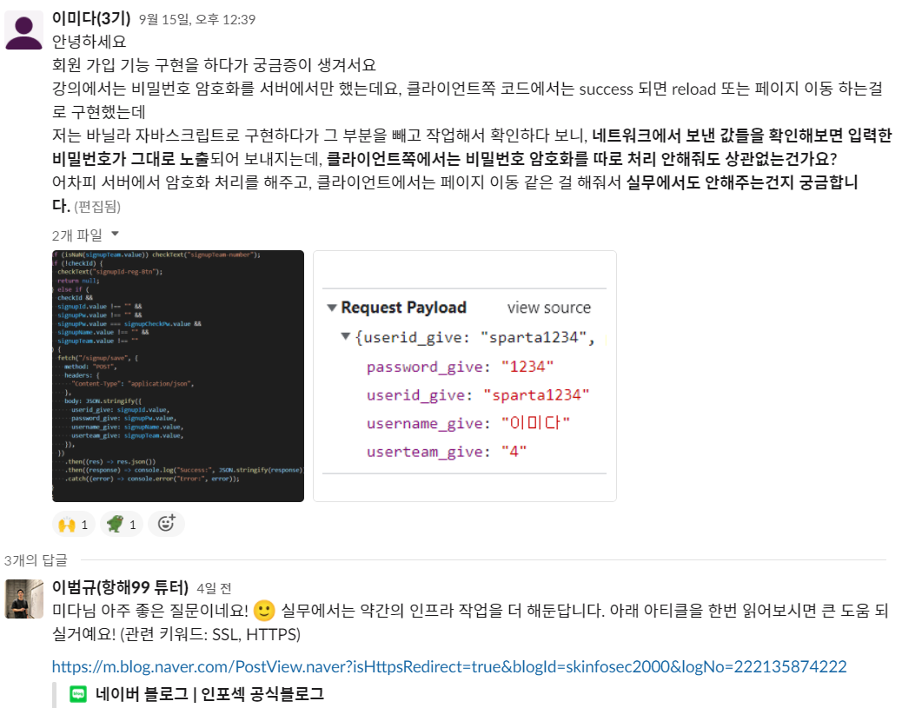

# 2021.09.13(월) 항해99 1일차 시작

오전에 간단하게 항해99의 커리큘럼 및 진행방식에 대한 설명을 하고, 바로 팀 프로젝트에 돌입하였다.<br />
나는 4조에 배정받았으며 4명으로 구성되었고, 바로 팀 프로젝트를 할 주제선정에 들어갔다.<br />
우리조는 항해99 시작하는 3기를 대상으로 방명록을 만들자는 의견이 나왔다.

## 제목 : PORT-us

<a href="http://port3.shop/" taget="_blank">PORT-us</a><br/>
<a href="http://youtu.be/sNWDKsgErVU" taget="_blank">유튜브 영상 보러가기</a><br/>
<a href="#" taget="_blank">문제 해결 과정</a><br/>

> 새롭게 항해를 시작한 3기를 위한 온라인 방명록 서비스입니다. 모든 3기의 항해원들은 간단한 회원가입 후, 각자의 팀별 방에 입장한 뒤 자유롭게 글을 남기며 다양한 정보 공유 및 부담없는 소통의 시간을 즐길 수 있습니다.<br />

이렇게 주제를 정한 뒤, 와이어 프레임 제작과 필수기능 및 api문서를 간략하게 만든 후, 어떤 기능을 만들지를 정했다.

## 우리의 필수기능

> 1.  로그인/회원가입 (나)
> 2.  메인페이지 입장시 전체 3기의 팀 방 목록 불러오기
> 3.  각 팀 방명록에 입장시 팀별 방명록의 CRUD(방명록 내용 불러오기, 방명록 쓰기, 방명록 삭제, 방명록 수정)
> 4.  마이페이지에 입장시 프로필 사진을 업로드 할 수 있고 마이페이지 정보 불러오기.
> 5.  10번째 방명록을 남기면 선물이벤트 (필수아님)

## 미니 프로젝트의 필수 포함사항

> - Jinja2 템플릿 엔진을 이용한 서버사이드 렌더링
> - JWT 인증 방식으로 로그인 구현하기

일단 위의 기능중 1~4가지가 필수 기능이였고 4명이였기 때문에 각자 원하는 기능을 담당하기로 했고, 나는 로그인/회원가입 기능을 맡게 되었다.<br />
다들 자신이 담당한 기능들 구현을 위해 인강을 더 봐야할 것 같다고 하셔서 오늘은 이렇게 각자 공부하기로 하고 내일부터 html, css로 뷰를 그리는 것부터 본격적으로 시작하자는 의견이 나왔다.

우리 팀원들은 나를 제외한 모두가 개발을 처음 하시는 분이였기 때문에 jinja2로 템플릿 나누는 부분 같은 기본 구조는 내가 해두는것이 일정에 맞추기 좋을 것이라 판단하여, 기본 구조를 잡고 팀장님 깃에 푸쉬하며 하루를 마무리했다.

# 09.14(화) 항해99 2일차

아침 7시에 팀원 한분에게 카톡이 왔다.<br />
개인사정으로 하차하신다는 내용이였다. 뭔가 어제부터 느낌이 별로 좋지 않았는데 역시나 하차를 하시다니😂<br />
9시에 나머지 팀원들과 모여서 얘기했는데, 팀장님이 어제 안그래도 그 팀원분 표정이 멘탈이 나간 것 같은 표정이셨다고 하셨다.<br />
역시 다들 똑같이 느꼈나보다.<br />
다른 팀원분도 자신도 어제 멘탈이 나가긴 했지만 그만두지 않을 것이라고 말해주었다.<br />
다행이였다.<br />
우리는 남은 인원들끼리 다시 힘내서 작업을 시작했고, 개발 스코프를 줄였다. 필수 기능인 1~3번만 맡아서 진행하기로 했다.<br />
내가 어제 만들어둔 jinja2 구조를 설명해드리며, git에 다들 미숙하니까 최대한 충돌이 안나게 각자의 html, css, js를 만들어서 불러오는 방식으로 진행하기로 했다.<br />
팀장님이 사실상 처음이셔서 어떻게 진행하면 좋을지 어려워 하신 것도 있고, 일정을 봤을때 이런식으로 흘러가다간 일정내에 절대 기능 제출을 못할 것 같다는 압박감이 들기 시작했다.<br />
일단 오늘 저녁까지 html, css 로 각자 대충이라도 기본적인 ui가 나와야 한다고 말씀드렸고 다들 부트스트랩이든 뭐든 써도 좋으니, 레이아웃 구성을 완료하자고 얘기하고 작업을 시작했다.<br />
그런데, 오후 5시쯤 중간에 확인해보니 아직까지 전혀 레이아웃 작업이 되지 않았었다😂😂<br />
다들 처음하시다보니 기본적인 html, css 방법을 어려워하셔서 이걸 내가 짜드려야 하나 고민을 하다가, 지금은 연습하는 기간이기도 하고 직접 해보시는게 아무래도 제일 좋다고 생각되어 힌트만 드리면서 진행하기로 했다.<br />
어려우시면 부트스트랩을 써도 좋다고 말씀드렸지만 잘 되지 않았고..<br />
결국 밤에 확인했을때 알록달록한 레이아웃이 되었지만 그래도 일단 어느정도 구조가 나왔다. (아직도 레이아웃 수정할게 산더미처럼 있었지만..)<br />
내일은 3일차고 금요일 밤 12시까지 제출이기 때문에.. 배포에 시간이 걸려서 금요일 오후2시 이전에는 끝내야 해서 내일부터는 무조건 기능개발 작업에 들어가야 한다고 말씀드렸고, 다들 오늘 그럼 더 html,css를 수정해주신다고 하셨다. <br />
일단 나라도 먼저 기능 개발을 빨리 완료시켜야 할 것 같아서 (항해에서 요구한 필수 기능이였기 때문에) 나는 인강을 보며 개발을 시작하였고, 중간중간 우리 팀원분들의 질문에 대답해주느라 나의 기능 개발 속도가 나지 않아서 마음이 급해지기 시작했다.

# 09.15(수) 항해99 3일차

어제 우리 팀의 진행사항을 다른 팀들과 비교해 보았을때 늦고 있다는 것을 알았다.<br />
이미 로그인/회원가입 기능을 다 끝낸 조들도 있었고 다들 벌써 어제 기능개발에 들어갔다는 소식을 들었다...<br />
초조함에 아침부터 멘탈이 나가 있었더니 사전 스터디때 만났던 괴물감자님께서는 이번 항해 시작하자마자 또 다른 팀의 팀장이셨는데, 아침에 시간을 내주셔서 나의 멘탈관리를 해주셨다..(천사에요?)<br />
일단 내가 팀장이 아닌데, 팀장처럼 하고 있는 것에 대한 불안감.. (나는 팀장의 인재가 아니라는 것을 누구보다 가장 내가 잘 알고 있었기 때문에..ㅋㅋㅋ)<br />
진행사항에 대한 초조함, 다른 팀원들을 봐주느라 정작 내 기능구현 속도가 너무 더디다는 것에 대한 불안감을 상담했더니, 일단 나는 사전 프로젝트를 해봤고 이대로면 기한 제출에 대한 압박감이 느껴지기 때문에 내가 일정조율하는 것은 어쩔 수 없는 것같다고 괜찮다고 말씀해주셨고, html, css 구성이 나오지 않고 어려워 하신다면 인강에 나와있는 bulma를 팀원분들에게 사용해보시라고 권하거나, 괴물감자님네 조는 괴물감자님이 bulma로 기본적인 레이아웃 구성을 다 해놓고 팀원분들에게는 필요한 최소 css나 html 구성을 맡기셨다고 했다. <br />정 안되면 내가 그렇게라도 해보는 것은 어떤지 제안해주셨고 이번 주차가 제일 힘들고 다음 주차부터는 다들 각자 주특기 기초부터 시작할테니 괜찮을 거라고 이번만 잘 버티라고 말해주셨다.<br />
울면서 뛰쳐나가고 싶었던 내 마음을 괴물감자님께서 잡아주셔서 다시 힘내서 작업에 돌입했다.<br />
그리고 아침 9시가 되서 팀회의를 시작했더니 우리 팀원분들이 어제 늦게까지 html, css를 수정해주셔서 대략적인 구조가 나왔다! 디자인이나 이런건 통일되지 않고 뒤죽박죽이긴 했는데 우리에게 중요한 것은 그런 디자인이 아니기 때문에 너무 좋았다.<br />
일단 팀원분들에게 이제 html, css는 그만 작업하고 기능개발에 들어가야 한다고 말씀드렸다.<br />
디자인같은 경우는 중요하지 않고 금요일날 배포후에 시간이 남으면 그때 디자인을 수정하자고 제안드렸고 모두가 알겠다고 해서 기능작업에 들어갔다.<br />
일단 나는 내가 맡은 모든 기능은 제이쿼리가 아닌 자바스크립트로 구현하는것이 목표였기 때문에 인강을 들으면서 자바스크립트로 구현하다가 회원가입 부분에서 궁금한점이 생겼다.

## 🤔 회원가입시 궁금한점. 비밀번호 암호화를 왜 서버에서만 해주지?

인강을 들으면서 기능구현을 하는데, 인강에서는 서버에서 (app.py)만 비밀번호 암호화를 해주고, 클라이언트에서는 reload나 페이지 이동으로 처리하는 것을 알았다.<br />
그부분을 당연히 빼고 네트워크에서 확인해보니 너무나 당연하게도? 비밀번호가 네트워크상에서 그대로 노출되는 것을 확인했다.<br />
너무나 의문점이 들어서 사전 스터디원분들에게 물어봤더니, 다들 클라이언트에서는 암호화 처리 따로 안해주고 인강에서 나온 대로만 해주셨다고 한다.<br />
그래서 질문방에 남겼고, 이범규튜터님에게서 답변이왔다!<br />
<br />
http와 https에 대해서 공부를 해야 된다는 것을 깨닫고 즐겨찾기를 해두며 일단, 가볍게 한번 읽고 추후에 다시 공부한 다음 정리해서 올려야 겠다고 마음먹었다.<br />
그렇게 나는 궁금증을 해소하고 마저 기능작업에 돌입했다.

# 09.16(목) 항해99 4일차

고비가 왔다.<br />
내일 낮이 되면 모든 기능을 마무리하고 배포를 시작해야되는데.. 기능 구현 속도가 너무 늦었다😂<br />
일단 나는 팀원들에게 정답을 알려드리지 않고 힌트를 주면서 스스로 해결하는 방법으로 하고 있었는데.. 팀장님께서는 힌트를 조금씩만 드리면 스스로 공부하고 인강도 찾아보고 하시면서 기능 구현에 속도가 나셨는데, 다른 팀원분은 많이 어려우셨나보다😂<br />
나도 내 기능개발을 해야 하다보니, a-z까지 설명을 해드릴 순 없어서.. 그분이 맡으신 기능은 메인페이지에 들어오면, 서버에 있는 데이터를 그냥 받아서.. 클라이언트에서 화면에 뿌려주는 기능이였는데 이 부분을 너무 어려워 하시길래 인강에 나와있는 주차를 알려드리고, 팀장님께서 구현하신 get부분을 참고해보시라고 말씀드렸다.<br />
내딴에는 정말 하나씩 알려드린 것이였는데 내가 설명을 잘 못해서ㅠㅠ 계속 어려워 하시길래 서버에서 배열값을 내려주는 부분을 내가 만들고, 이제 버튼을 클릭했을때, 내가 만든 api route주소를 찾아가서 클라이언트에서 받는 부분으로 해달라고 말씀드렸다.<br />
로그인 기능은 구현했고, 로그인된 회원이 메인페이지에 방문하면 자신의 팀 방에만 입장해야 하고, 팀 방에 입장하면 자신이 속한 팀의 방명록들을 모두 가져와서 뿌려주는 부분은 팀원들이 아닌 내가 해야되는 부분이여서 팀원들이 맡은 기능을 다 할때까지 기다리다가는 제출을 못할 것 같다는 압박감이 또 들기 시작했다.<br />
그래서 일단 내가 테스트파일을 만들어서 거기서 테스트 하는 방법으로 하고, 팀원분들에게는 일정 압박감 느끼지 말고 지금 프로젝트에는 기능 완성을 무조건 해야된다는 압박감보다는 클라이언트와 서버와 통신하는 부분을 이해하는 것만으로 하자고 안내드렸다.<br />
그리고 나는 밤을 새서... 모든 기능 구현을 완료하였다.😂😂<br />
원래 사실 밤샐 생각은 아니였는데.. 새벽까지 코딩하다보니 사전스터디의 또 다른 감자님께서 jinja2로 페이지를 나누지 않아 감자님네 조는 깃 충돌이 너무 많이나서 고민이라고 하셔서 이부분을 같이 고민하며 해결하다보니 5시 6시가 넘었길래 그냥 둘다 안자고 작업했다.

# 09.17(금) 항해99 5일차. 끝.

그리고 우리의 밤샘을 알게 된 다른 감자님들께서 일찍 일어나셨길래 또 9시 전에 사전 스터디 감자조가 모여서 서로 각자의 팀들의 현재까지의 결과물을 서로 공유했는데
역시 우리 감자들의 리더 괴물 감자님네 조의 것이 굉장히 흥미로웠다.<br />
그림판을 이용해서 그림을 그리고 기분을 표현하는 것이였는데 재밌었다.<br />
그리고 9시가 되어서 다들 자신의 조로 흩어지고 우리 팀원분들께 기능 개발된것에 대해 말씀드리고, 나는 자바스크립트로 구현했으니까 팀원들이 어려웠던 부분들을 내것을 참고해서 마저 구현해보시라고 말씀드리고 나는 자러갔다.<br />
우리 팀장님께서는 맡은 모든 기능을 다 하셨고 딱 삭제만 어려워하셨던 것이여서, 금방 수정을 해주셨고, 다른 팀원분께서는 좀 어려우셨나보다.<br />
정말 내가 이번 프로젝트를 하면서 계속 고민인게, 이렇게 어려워 하실때는 내가 어떻게 도와드려야 할지 잘 모르겠다. 나는 나름대로 열심히 계속 하나씩 설명했다고 생각하는데 아무래도 나도 잘 모르고 한참 부족한 상태인데ㅠㅠㅠ 설명을 어떻게 쉽게 설명을 드려야 할지 방법을 잘 모르겠다보니, 이 부분이 팀 프로젝트에서 가장 어려운 부분이 아니였나 싶다.<br />
일단 배포에서 생각지 못한 일들이 발생한다는 것을 사전 스터디의 경험으로 알고 있었기 때문에 나는 오후에 일어나서 바로 배포를 먼저 시작했고, 다행히(?) 배포때 많은 문제가 있던 다른 조들과는 다르게 우리는 무사히 배포가 완료되었다.<br />
사실 배포가 잘못되면 내가 해결할 수 있을까 엄청 초조해하고 떨면서 배포했는데 너무 너무 다행이였다.<br />
배포가 완료되고 그때까지 자신의 기능 구현을 수정하고 작업해주셨던 팀원분들의 코드를 합치고, 코드정리도 하고 유튜브 영상도 찍고 하다보니 시간이 훌쩍 지났고, 우리는 무사히 12시 전에 제출 기한에 아슬 아슬하게 맞춰서 제출할 수 있었다.<br />
항해 시작하자마자 너무 너무 힘이들었지만, 완성된 결과물을 보니 보람찼다.<br />
4조 팀원분들 정말 고생하셨습니다.👍👍👍

# 09.18(토) 항해99 6일차. 프로젝트 결과물을 보고 멘토님과의 면담.

토요일은 팀원들끼리 모여서 결과물들에 대한 회고를 정리하면서 다시 한번 배웠던 점이나 이해안되었던 점을 적었고, 오후에 20분간 멘토님과 결과물을 보고 멘토링을 받을 수 있는 기회가 있었다.<br />
이때 멘토에게 2가지 질문을 할 수 있었는데, 나는 팀원분들에게 1개씩 질문하는 것을 양보했고, 팀원분들이 각자 자기가 어려웠던 점을 멘토님께 공유하다가 뜻밖의 나의 코드 공개 처형이 있었다.😅😅😅

## 사건은 이러했다.

메인페이지에 들어갔을때 서버에서 전체 데이터를 받아와서 화면에 뿌려주는 기능을 담당했던 팀원분이 내가 자바스크립트로 짠 코드를 보고 ajax로 다시 작업해보면서 공부해보라고 말씀드렸는데, 결국 구현을 못하셔서 어디가 어려웠는지를 공유하다 보니 내 코드도 같이 비교하면서 공유하게 되었다.<br />
멘토님이 내가 자바스크립트로 구현한 코드를 보면서 일단 자바스크립트로 짠 코드도 잘 짠 코드는 아니라고 하셨다.ㅋㅋㅋㅋㅋㅋㅋㅋㅋ으앙😂😂😂

```javascript
function loadList() {
  fetch("/roomlist/number", {
    method: "GET",
    headers: { "Content-Type": "application/json" },
  })
    .then((res) => res.json())
    .then((response) => {
      const team = response.team;
      const name = response.name;
      const id = response.id;
      // 미리 만들어진 방 번호를 서버에서 받아온다.
      const roomsArray = response.listArray;
      const roomlistWrap = document.querySelector(".roomlist-wrap");
      // 서버에서 받아온 방 번호들은 배열의 형태임으로
      // map으로 돌면서 하나씩 추가해준다.
      roomsArray.map((rooms) => {
        roomlistWrap.innerHTML += `
                <div class="roomlist ${rooms}"  onclick="userRoomCheck(event,${team},'${name}','${id}')">
                  <p class="room-team-number">${rooms}팀</p>
                </div>
            `;
      });
    })
    .catch((error) => {
      console.log(error);
      alert(error);
    });
}
```

## 내 코드의 문제점

1.  const roomlistWrap = document.querySelector(".roomlist-wrap");

- ES6로 구현하려면 querySelector가 아닌 다른 방법으로 선택자를 잡는다고 조언해주심.

2. map의 문제점.

- 일단 제이쿼리를 사용하지 않고 자바스크립트로 구현하면서 공부하는 방법은 좋은 자세이지만, 이것은 팀 프로젝트이기 때문에 다른 팀원이 내 코드를 이해하지 못한다면 그것은 좋은 코드가 아니다.<br />
  팀원이 map에 대해서 이해하지 못하고 있고, 전체적인 스크립트로 구현된 코드를 이해 못하기 때문에 좋지 못하다고 말씀하셨다.<br />
  지금 내가 한 방법은 개인 공부를 위한 프로젝트이고, 우리는 팀 협업 프로젝트이기 때문에 팀원들이 알아 볼 수 있게 하는게 좋다고 하셨다.

3. fetch 는 옛날 방식.
   ES6로 구현하려면 1번과 마찬가지의 이유처럼, fetch가 아닌 최신 방법으로 통신을 하는것을 추천하셨다.

뜻밖의 공개 처형이긴 했지만, 코드 리뷰를 받을 수 있었던 기회에 감사했다.<br />
멘토님이 남들처럼 제이쿼리로 만들지 않고 자바스크립트로 구현하면서 공부하는 공부 방식은 굉장히 좋다고 말씀해주시면서, node를 하면 잘할 것 같다고 주특기로 node를 하시는 것을 추천해주셨다.<br />
나는 백이 너무 어렵기 때문에 react를 할거라고 말했지만.. 어차피 react를 해도 node 해야된다면서 강력한? node 권유가 있었다.<br />
node를 해야 된다는 것도 알고 있지만 일단.. react도 못하기 때문에 react부터 잘하고 node 공부를 하는것으로.......ㅎㅎㅎ<br />
다른 감자님들은 자바스크립트로 구현한 것에 대해서 칭찬받았다고 해서.. 나는 살짝 우울해졌지만.. (나는 왜..?ㅠㅠ😂)<br />
아무튼 1기 멘토님의 조언대로 코드를 다시 수정해야겠다고 마음먹었고, 저녁에는 매니저님들과의 맥주타임이 있어서 모였지만 매니저님은 우리가 있는 그룹에는 나타나지 않으셨다ㅠㅠ 왜죠? 우리는 버림받은 것인가요?ㅠㅠ<br />
모여있는 공간이 크게 4공간 이였는데 매니저님들은 그 중 두개의 공간에만 계셨고 나는 사전 스터디 모임인 감자님들이 모여있는 곳으로 갔는데 거기에는 우리 감자들의 리더 괴물 감자님네의 스터디원분들도 계셔서 같이 인사하고 얘기하면서 회고를 풀었는데 우리쪽에도 다른 분들이 오셔서 각자 회고하는 타임을 가져서 너무 좋았다.

# 1~5일차의 마무리

이제 일요일이고 연휴니까 못잤던 잠을 좀 자면서..<br />
멘토님께서 조언해주신대로 코드를 수정좀 하고.. 우리 프로젝트에서 꼭 필요하다고 생각되는 기능 2가지가 더 있어서 연휴때 그 부분을 좀 추가하고, 주특기 강의가 월요일부터 열린다고 하니, 리액트 스터디에 참여해서 미리 공부도 좀 해야될 것 같다.<br />
그리고 이번 프로젝트를 하면서 나는 예외처리에 굉장히 신경을 많이 썼는데, 예외처리를 하면서 어려웠던 점이나 기능 구현을 하면서 새로 알게된 사실들을 따로 정리해서 올릴 예정이다.
