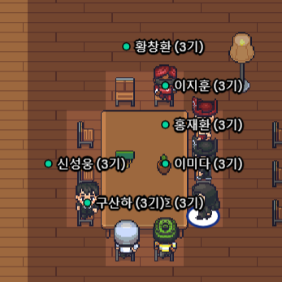
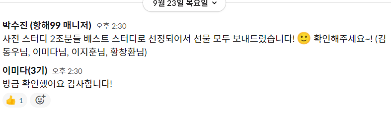

# 2021.09.20(월) 항해99 8일차, 추석 연휴

추석 연휴 기간이지만, 주특기 인강을 오늘부터 열어주셨다. 
심지어 22일(수)까지 주특기 2주차 까지 강의를 완강해야 한다는 공지가 올라왔다.

> 연휴인데도 쉬지 못하는 항해99..

리액트 시작 전부터 리액트 인강의 내용이 다른 주특기인 노드나 스프링보다 훨씬 양이 많다는 얘기를 들었다. 
그래서 미리미리 조금씩 들어두는 것이 좋겠다고 생각되어 강의를 듣기 시작했다. 
생각보다 한 강의당 양이 많아서(😂😂) 연휴 때 미리 조금씩 들어둬야 진도를 따라 갈 수 있을 것 같다는 판단하에 조금씩 적기 시작했다.

> ## 😊 PORT-us 기능 추가
>
> 리액트 강의를 듣다가.. 일요일부터 생각했던 1주차 미니 프로젝트에 꼭 필요하다고 생각되는 기능이 2가지가 있었는데, 그게 계속 생각나서 기능 추가부터 해야겠다는 생각이 들었다. 

### 추가 할 기능

1. 회원가입시 입력한 팀 번호 수정 기능 (항해99는 매번 팀이 바뀌기 때문에)
2. 새로운 팀별 방명록에 입장했을시, 기존 팀이 남겨둔 방명록 메세지를 모두 전체 삭제하는 기능.
   > 현재는 메세지 삭제는 방명록을 작성한 회원 본인만 삭제할 수 있었다.  하지만 항해는 매번 팀이 바뀌기 때문에 새로운 팀으로 변경되어서 팀 방명록에 입장했을 경우, 기존의 팀원들이 남겨둔 방명록을 삭제할 수 없어서 불편할 것 같았다.

이런 판단하에, 오늘은 가볍게 리액트 강의를 듣고 계속 찝찝했던 기능들을 작업해야겠다는 생각이 들어 **기능 작업을 완료**했다!😁😁

# 2021.09.21(화) 항해99 9일차, 추석 당일

어제 문득 그런 생각이 들었다. 
지금 쉬지 않으면, 항해 끝나기 전까지 다신 쉴 수 없을 것이란 생각. 
그래서 오늘은 완전 늦잠도 자고 넷플릭스도 보면서 뒹굴거리고 영화도 한편 봤다. 
너무 너무 행복했다😭 
그렇게 뒹굴~~ 뒹굴~~ 거리는데 카톡방에서는 여전히 공부하시는 분들의 카톡 알람이 계속 울렸다. 
연휴에도 이렇게 열심히 공부하시는 다른 분들을 보니, 뒤쳐지지 않으려면 나도 해야겠다는 생각이 들었다 흡..😂😂 
뒤늦게 저녁에 게더에 접속해보니 20~30명 정도 되시는 분들이 연휴임에도 불구하고 게더에 접속해계셨다.. 
리액트 강의를 신청하신 분들 얘기를 들어보니 2주차 중간까지 들으신 분들이 꽤 계셔서 나도 부랴 부랴 인강을 켜서 듣기 시작했다.

밤 11시가 넘었는데도 공부중이신 이분들.. 무엇 
역시 연휴에 공부하는 것은 무리였나보다. 
밤 12시가 넘어가자 한명씩 나사가 빠지기 시작했고 모두가 전염되었다. 🙄 
다들 나사빠진 소리를 하며 잡담도 하다가 다시 정신차리고 인강을 들었다. 
2-6까지 완료했다!!! 
내일은 2주차 강의 모두 다 듣고, 가능하다면 3주차 중간까지 듣는 것을 목표로 해야겠다.

# 2021.09.22(수) 항해99 10일차, 마지막 연휴

마지막 연휴는 쉬엄 쉬엄 하기로 결정했다. 
느낌이 오늘 아니면 더이상 쉴 수 없을 것 같은 느낌이었다. 
연휴에 미리 들어두면 좋다던 리액트 기초 강의 2주차 강의까지 딱 듣고 쉬었다.

# 2021.09.23(목) 항해99 11일차, 리액트 기본 시작.

다시 항해가 시작되었다. 
힘들었던 1주차 미니 프로젝트를 뒤로하고, 새로운 2주차 발제가 소개되면서 새로운 팀 배정이 있었다. 
여기서 나는 21조 팀장이 되었는데 명단을 보자 마자 당황했다. 
왜.......내가 팀장..? 
뭐 어차피 돌아가면서 팀장할거면, 차라리 이번 주차처럼 개인 프로젝트 하는 주에 팀장된게 차라리 잘되었다 싶었다. 
팀 프로젝트일때 팀장이면, 그 역활을 제대로 하지 못해서 힘들었을 테니까. 
이번주부터는 리액트 기본 강의를 듣고 개인 프로젝트를 하는 것이다 보니, 팀원들이랑 딱히 대화할 일이 없다. 
그래서 그런지 아싸인 나는 이 어색한 적막이.. 너무 힘들다 😭😭 
감자님들 조는 어떠냐고 물어보니, 다들 똑같이 말없이 공부만 한다고 해서 그렇구나 하며 넘어갔다. 
리액트 강의가 양이 많다는건 사전에 미리 듣긴 했지만 양이 정말 너무너무 많았다ㅠㅠ 
주차별 강의가 끝나면 개인 숙제는 또 따로 제출해야만 해서, 진짜 너무 시간이 부족하다고 느끼며 열심히 강의를 들었다. 
처음부터 리덕스를 사용해서 과제를 제출해야해서 좀 버겁긴 했지만, 오늘 하루만에 3주차 강의를 다 듣고 리덕스 과제까지 제출해서 다행이였다. 
해설영상이 1시간..(😂)짜리여서... 내일 일어나서 보기로 결정했다.

> ## 🥰 오늘 베스트 사전 스터디에 뽑혔다!
>
> 오늘 베스트 사전 스터디에 당첨되었다고 매니저님한테 연락이왔다.
>  
> 항해 시작하기 전 사전 스터디에 참여해서 열심히 스터디원 분들과 공부하며 프로젝트를 만들었기 때문에 기분이 너무 좋았다! 
> 감자님들 덕분에 이런 선물도 받습니다 감사해요(😁😇🥳) 
> 사전 스터디인 감자님들과 함께한 프로젝트와, 프로젝트를 하면서 겪었던 문제들은 <a href="#" target="_blank">사전 스터디 프로젝트</a> 여기서 확인 가능합니다.

# 2021.09.24(금) 항해99 12일차, 리액트 기본 시작 2

어제 미처 못봤던 3주차 과제 해설 영상을 보면서 복습을 하며 하루를 시작하기로 했다. 
분명히 9시에 1시간짜리 3주차 과제 해설 영상을 보기 시작했는데 11시가 넘어서도 보고있다...😅 
너무 양이 많고 집중도 잘 안되서 팀원분들에게 물어보니, 팀원 한 분은 어제 해설 영상만 5시간 보셨다고 했다. 
그 말을 듣고 너무 무서워져서 오전 중으로 보고 말겠다는 각오로 열심히 해설 영상을 봤다. 
다행히 해설 영상을 목표대로 오전중으로 모두 학습하고, 다시 4주차 강의를 듣기 시작했다. 
4주차 강의는 파이어 베이스에 대해서 배웠는데 대충 듣다가 숙제가 파이어 베이스랑도 연결해서 하는 숙제였다. 
역시 뭐든 대충 들으면 망하는구나..😂 
일단 퀴즈 숙제를 리덕스를 사용해서 모두 구현하고 그 후에 파이어 베이스 부분에서 막혀서 괴물 감자님을 호출했다. 
괴물 감자님네 조에 기웃 기웃거렸더니 역시 천사 괴물 감자님네 조는 활발하게 얘기중이셨다. 
그리고 다른 감자님네 조도 염탐했는데 거기도 활발하게 얘기를 하고 계셔서 급 우리 팀원들과 너무 대화가 없었다는 생각이 문득 들었다. 
뭔가 대화를 해야할 것 같은데 뭐라고 말을 해야할지도 모르겠어서.. 고민했는데 팀원분들도 1주차는 팀 프로젝트라 말을 많이 했는데, 이번 주차는 리액트가 너무 어렵기도 하고, 개인 프로젝트 하느라 바빠서 미처 대화할 시간이 없었다고 다들 말해주셨다. 
내일.. 대화하는 시간을 조금 갖자고 얘기하고 다시 과제에 집중했다. 
지치고 힘들었던 리액트 4주차 과제를 끝내고 잠이 아직 안들어서 감자님들과 수다를 떨며 각자의 어려움에 대해 토로했다. 
근데 다들 주특기부터 어렵고 지쳐서 그런지 이제 의식의 흐름대로 말하는게 익숙해진 것 같다. 
내일은 정신차리고..😁 다시 내일 목표인 5주차 강의 다 듣고 과제까지 제출하기를 완료해야 겠다.

# 2021.09.25(토) 항해99 13일차, 리액트 기본 시작 3

오늘도 역시 리액트 기본 강의를 듣기 시작했다. 
오늘은 5주차를 듣고 5주차 숙제까지 제출하고, 내일부터 최종 프로젝트를 만든 후 제출하면 끝난다. 
뭔가 쉴새없이 강의 들으며 공부했더니 지겨워져서 카페에서 공부했다. 
카페에서 공부하면 더 집중이 잘될줄 알았는데 아니였다. 
5주차 강의는 미들웨어 사용하는 것과 완성된 프로젝트를 배포하는 내용이였다. 
미들웨어가 좀 헷갈려서 몇번 더 해본면서 확실히 익혀야 할 것 같다. 
리액트는 왜 자꾸 어려운가..😂 
그래도 오늘 목표인 5주차 강의 완강 후 5주차 숙제 제출까지 완료해서 기쁘다. 
최종 프로젝트 과제는 생각보다 기능이 적어서 내일 하루는 조금 쉬면서 해야겠다.

# 2021.09.26(일) 항해99 14일차, 휴식

어제 리액트 기초 최종 과제인 사전 만들기의 UI 작업을 하다가 재미있어서 오늘까지 UI 작업과 리덕스로 전역 상태 관리하는 것 까지 완성되었다. 
이제 미들웨어 사용해서 파이어베이스랑 통신하는 부분이 남았는데, 그 부분은 내일부터 시작하기로 했다. 
원래 일요일 하루 정도는 휴식을 취하면서 아무것도 안하려고 했는데 UI를 한번 작업하다보니 어쩌다가 해버려서.. 내일부터 제대로 다시 시작하려면, 남은 시간이라도 충분히 휴식을 취해야겠다.
