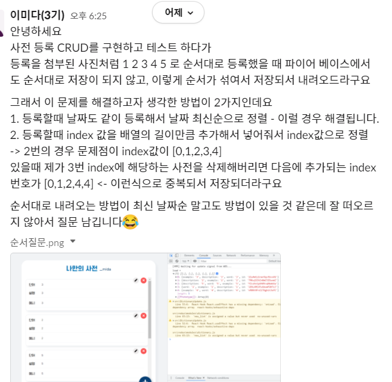
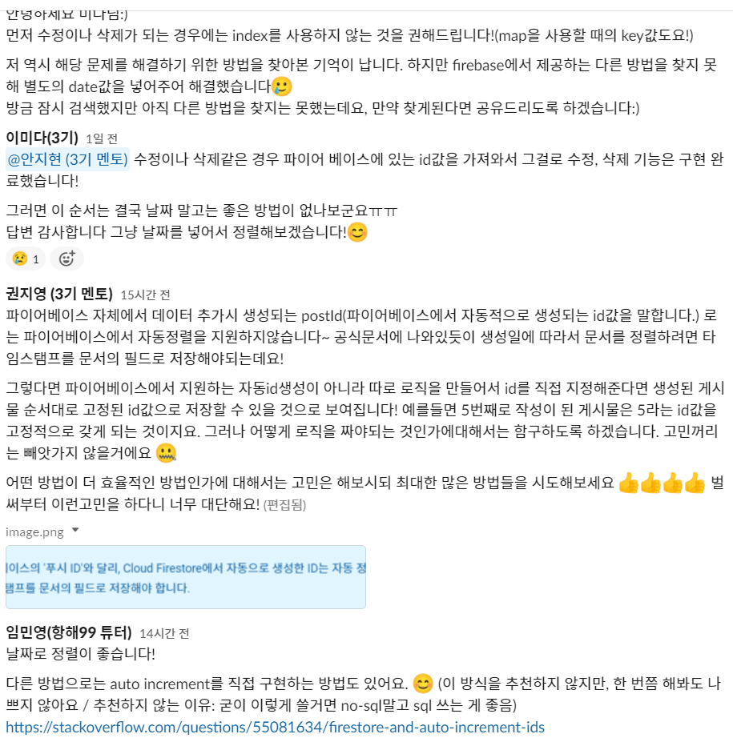
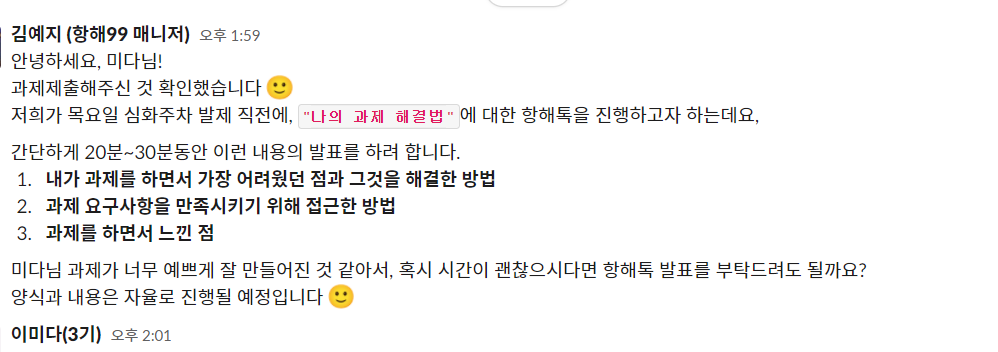

# 2021.09.27(월) 항해99 15일차

오늘 아침까지만 해도 난 리덕스로 혼자 파이어 베이스랑 연동해서 CRUD 다 구현했어! 
이제 미들웨어 사용해서 파이어베이스랑 통신하면 끝이야! 
쉬엄 쉬엄 하면 오후 3시쯤이면 끝나겠지~~ 라는 말도안되는 건방진 생각을 했다. 
이 생각이 얼마나 건방진 생각이였는지 깨닫기까지 오래 걸리지 않았다.😭 
`미들웨어를 사용하면서 어? 이거 되야하는데 왜 안되지?` 와 `어? 이거 이렇게 쓰라고 했던거 아닌가? 어떻게 사용해야하지?`의 연속이였다. 
import를 해올때 어떤걸 불러와야 하는지, 어떤 것들을 추가해줘야 하는지는 인강을 다시 들으며 했고, 되야하는데 왜 안되지?의 연속은 이것저것 삽질과 수많은 `console.log`를 찍으면서 해결했고, 그래도 도저히 안풀리는 것들은 인강을 보며 다시 작업했다. 
그리고 파이어 베이스랑 연동하다보니, 사전에 등록한 순서대로 뷰로 뿌려지지 않는 부분이 생겨서 (아마 noSQL이여서 그런것이 아닐까 추측) 어떻게 정렬을 해줄까 고민하다가 index로 하는 방법은 여러 문제들이 생겨날 것 같아서, 등록할때 날짜를 같이 추가한 후 날짜 최신순으로 정렬하면 되겠지만, 다른 방법이 더 있지 않을까 싶어 슬랙에 질문을 남겼다. 
 
 
답변이 되게 정성스럽게 와서 너무 감사했다. 
그래서 결국 일단 조언대로 날짜로 구현해서 프로젝트를 완성했고,
나는 나름 이렇게 모두 구현하고 완성되어서 `음 이정도면 나쁘지 않군`하며 있었고, 어쩌다가 새로운 분들이랑 게더에서 얘기할 기회가 생겼는데 항해 시작하자마자 눈여겨 보았던 고수 2분중에 한분이 계셨다. 
그분은 최적화까지 생각해서, 전체 list를 파이어 베이스에서 불러오는건 새로고침 상태인 첫 화면에 들어온 그 한번만 불러오고, 나머지는 리덕스랑 상태관리를 통해서 리소스도 줄이면서 구현을 모두 하신것이였다!! 
나같은경우 list 컴포넌트에서 <code>useEffect</code> 안에 <code>dispacth</code>로 미들웨어 함수를 호출해서 리스트 컴포넌트의 값이 변경되면 계속 호출되는 문제가 있었는데, 그분은 그것까지 고려하셔서 전체적인 흐름을 보시고 직접 최적화까지 하셨다. 
`엄청나다. ` 
심지어 이건 기본 강의에서도 다뤄지지 않아서, 그분은 그냥 혼자 생각하며 이러면 되지 않을까 하면서 구현했다고 했는데 내가 모든것을 이해하진 못했지만 그분의 방법이 맞았다고 생각한다. 
풀스텍을 했던 경험이 있다고는 하셨지만 그래도 나는 코앞만 보고 있는데 저 멀리까지 생각해서 구현하는것을 보고 나도 저런 사고를 가져야지 하고 생각했다. 
그래서 오늘 뜻밖의 좋은 경험이 있었다. 
원래 **리액트 기본 최종 프로젝트의 필수사항은 읽기(Read), 등록(Create)까지**였고, 그 외 추가로 하실 분들은 수정(Update)과 무한 스크롤을 해보라고 되어있었지만 오늘의 경험을 통해서 나는 아직 미숙한 미들웨어를 남은 2틀동안 개념을 더 잡고 연습을 해보는 것이 좋다고 생각되어 이번 프로젝트와 비슷한 다른 개인 프로젝트를 만들어서 다시한번 되짚으며 구현해보기로 결심했다. 
항해에는 이렇게 경력자들도 많고 경력이 없어도 이해도가 좋으셔서 금방 금방 성장하시는 분들이 많이 계신다.  
나는 그들처럼 전공자도 아니고 머리도 나쁘니까 욕심내서 다른것을 추가하는 것보다는 기본에 충실하자고 마음을 다독이면서 하루를 마무리했다.

# 2021.09.28(화) 항해99 16일차

오늘은 오전부터 일이 많아서 조금 쉬엄쉬엄 하고 있었다 
사실 어제 2주차 최종 과제를 제출했으니 남은 2틀은 좀 쉬면서 해야지 라고 생각했고, 우리 팀원 분들에게 도와드릴 것 있냐고 물어봤더니 다들 스스로 잘 해결해나가고 계셔서 이번 주차 팀장이지만 팀장이 필요없을 정도여서 쉬고있었다. 
그러다가 매니저님에게 과제 제출한 것에 대해서 발표할 기회가 있는데 해보지 않겠냐는 메세지가 왔다. 
 
내가 퍼블리셔를 했던 경험이 있어서 다른 항해 분들보다 css구현을 좀 빠르게 하다보니, 남들보다 디자인이 조금 더 예뻤을 수 있는데, 그래서 이런 제안을 주셨던 것 같다. 
너무 너무 좋은 기회여서 기회를 주심에 감사했지만, 나는 어릴때부터 무대 공포증 때문에 사람들 시선이 나한테 모이고 발표해야 되는 상황이 생기는 부분이 너무 어려웠기 때문에 (면접에서도 이런 부분때문에 항상 어렵다. 왜 나는 그냥 계속 얼음 상태일까😭) 도저히 이 많은 사람들 앞에서 과제를 발표할 수 있을 것 같지 않았다. 
그래서 죄송하지만 거절했다. 내 성격이 좀 고쳐지고 다음번에 또 이런 좋은 기회가 생긴다면 그때 도전해보기로 했다. (앞으로 기회는 없을지 모르지만^^) 
아무튼 이런 이유로 좀 오늘 하루는 쉬엄 쉬엄하고 있다가, 어제 만난 고수님께서 게더에서 잠시 시간되냐고 하셔서 얘기하다가, 역시 이 고수님도 과제 발표 제의를 받았어서 발표를 하기로 결정하면서 강의에서 다루지 않은 본인이 이해하신 플로우대로 구현했는데 이렇게 해도 되는지 의문이라고 문의를 하셨다고 했다. 
그래서 튜터님 피드백을 기다린다고 해서, 피드백 오면 그때 같이 들어도 되냐고 물었더니, 흔쾌히 알겠다고 해주셨다.😊 
그리고 저녁에 튜터님 피드백을 받으셨다고 해서 사전 스터디 감자님들과 함께 같이 들었고, 결론적으로 말하자면 역시 고수님이 생각하셨던 플로우와 코드 구현이 맞았다는 것이였다. (와우!!) 
그리고 나서 벌써 지금 밤 11시가 넘었는데, 오늘 하루 나는 그냥 미들웨어 강의를 한번 더 들었을 뿐 아무것도 한게 없다는 것을 깨달았다.😭 
그저 과제 제출 끝났다고 너무 방심하고 있었던 것 같다는 생각이 들었다. 
내일은 정말 빡세게 다시 공부에 집중해서 과제 제출한 것과 비슷한 개인 플젝을 만들어서 미들웨어로 한번 더 구현해보는 연습을 해야겠다!

# 2021.09.29(수) 항해99 17일차

오늘은 드디어 1주차의 마지막 날이다.
미들웨어 사용이 익숙해지기 위해서 오늘은 개인 실험실용으로 투두리스트 프로젝트를 만들어서 다시 한번 CRUD를 구현했다. 
확실히 한번씩 한번씩 더 사용할때마다 윤곽이 잡히고 느는 것을 발견했다. 기뻤다.😁 (물론 아직도 한참 부족하지만..) 
오늘 팀원분들에게 물어보니, 다른 두분은 모두 과제 완료를 하셔서 제출하시고 복습하신다고 하셨고, 한분은 오늘 과제 시작한다고 하셔서 어려움이 있으면 도와드린다고 했고 질문하실때마다 다같이 화면을 보면서 도와드리긴 했지만 도움이 많이 되었는지 모르겠다. 
확실히 개인 프로젝트는 팀으로 조가 짜여져도 좀 애매한것 같다. 
내일은 새로운 발제가 시작되어 팀이 변경되는 것으로 알고 있는데 내일부터 시작되는 프로젝트도 개인 프로젝트 같아서 이번 주차에 팀별 활동에서 팀원들과 교류가 많이 없었다는 후회를 하고 있어서 내일 변경된 팀에서는 좀 더 교류를 많이 하도록 노력해야겠다. 
